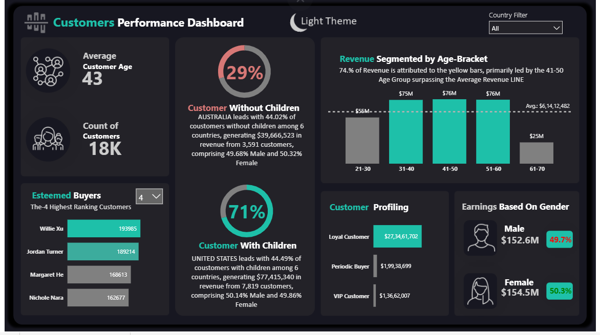
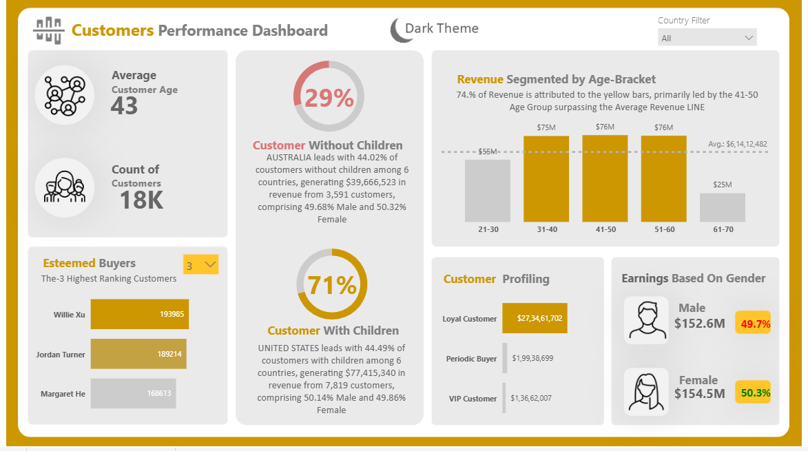

# 📊 Customer Performance Dashboard (Power BI)

## 📌 Overview  
This project presents an interactive **Customer Performance Dashboard** built using Power BI to analyze customer demographics, revenue trends, and behavioral patterns. The dashboard enables dynamic exploration of data across multiple countries with real-time insights.

---

## 🎯 Key Features  
- 🌍 **Dynamic Country Filter** – Analyze data across different countries using slicers  
- 🔄 **Real-Time Data Updates** – Visuals automatically update based on user selection  
- 🎨 **Light/Dark Mode Toggle** – Enhanced user experience with theme switching  
- 👥 **Customer Segmentation** – Analysis by age group, gender, and customer type  
- 📈 **Revenue Insights** – Identify top-performing segments and revenue drivers  
- 🏆 **Top Customers Analysis** – Highlights highest contributing customers  

---

## 📊 Key Insights  
- 📌 **18K+ customers analyzed** with an average age of 43  
- 📌 **74% of revenue** generated from age group **31–60**  
- 📌 **41–50 age group** is the highest contributor (~$76M)  
- 📌 **Loyal customers contribute ~$273M+**, highest among all segments  
- 📌 **71% customers have children**, forming a major revenue segment  
- 📌 **Balanced gender contribution** (~50% male & female)  

---

## 🛠️ Tools & Technologies  
- Power BI  
- DAX (Data Analysis Expressions)  
- Data Modeling  
- Data Visualization  

---

## 🚀 Business Impact  
- Enabled **data-driven decision-making** through interactive dashboards  
- Helped identify **high-value customer segments** for targeted marketing  
- Improved understanding of **customer demographics and revenue distribution**  
- Enhanced usability with **interactive filters and theme customization**  

---

## 📷 Dashboard Preview  
> ### 🌙 Dark Mode  

### ☀️ Light Mode  

---

## 📂 How to Use  
1. Open the Power BI report  
2. Use the **Country slicer** to filter data  
3. Explore customer segments and revenue trends  
4. Toggle between **Light/Dark mode** for better visualization  

---

## 📌 Future Enhancements  
- Add predictive analytics (forecasting revenue trends)  
- Integrate real-time data sources  
- Enhance drill-down capabilities  
